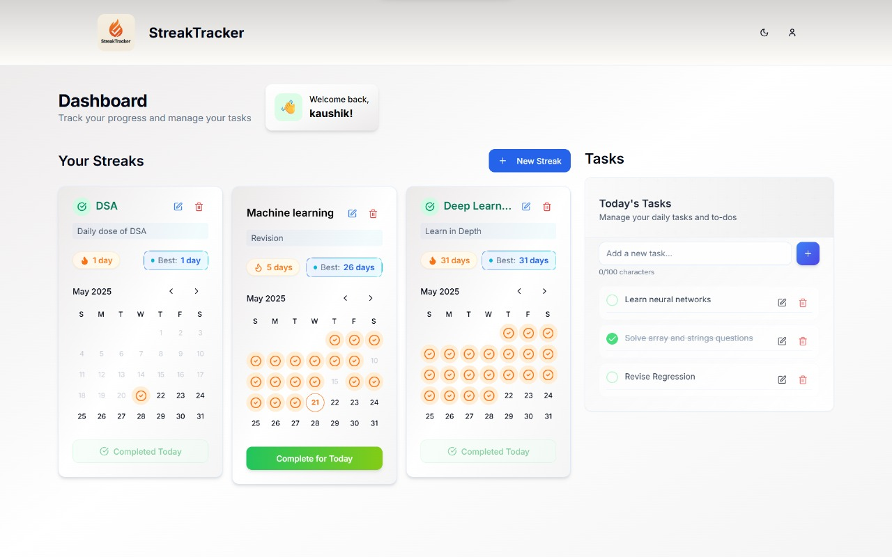
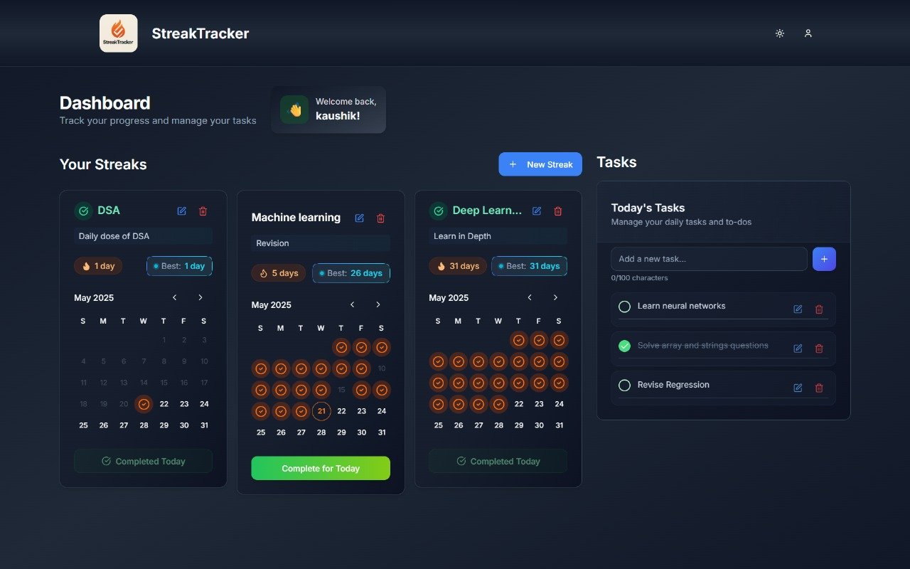

# 🔥 StreakTracker

## 📝 About

**StreakTracker** is a web application designed to help users build and maintain daily habits by tracking custom streaks and managing daily tasks. By visualizing progress and promoting consistency, it serves as a motivational tool for individuals aiming to stay on track with their goals.

---

## 🌐 Live Preview

👉 [**Live App**](https://streak-tracker-psi.vercel.app/)

---

## ✨ Features

* ✅ **Custom Streak Creation**: Define and monitor personalized habits.
* 📋 **Daily Task Management**: Add, edit, and delete daily tasks to stay organized.
* 📈 **Progress Visualization**: View streaks and task completion history to assess consistency.
* 🧭 **User-Friendly Interface**: Navigate effortlessly through an intuitive design.
* 📱 **Responsive Design**: Works great on mobile, tablet, and desktop devices.

---

## 🛠️ Tech Stack

* **Frontend**: Next.js ⚛️, TypeScript 🟦, Tailwind CSS 🎨
* **Backend**: Node.js 🌐, Express 🚂
* **Database**: MongoDB 🍃
* **Deployment**: Vercel ▲, Render⚡

---

## 🖼️ Sample Images

> 📸 Add your screenshots in this section under the `client/public/assets` folder or wherever they are hosted.

### 🏠 Home Page


### 💡 Dashboard (Light Mode)



### 🌙 Dashboard (Dark Mode)



---

## 📁 Project Structure

```
StreakTracker/
├── client/                 # Frontend source code
│   ├── public/             # Static assets
│   └── src/                # React components and pages
├── server/                 # Backend source code
│   ├── controllers/        # Route handlers
│   ├── models/             # Mongoose schemas
│   └── routes/             # API endpoints
├── .gitignore
├── package.json
└── README.md
```

---

## ⚙️ Installation

### ✅ Prerequisites

* Node.js and npm
* MongoDB instance (local or cloud)

### 🚀 Setup Instructions

1. **Clone the Repository**

   ```bash
   git clone https://github.com/kaushik-kadari/StreakTracker.git
   cd StreakTracker
   ```

2. **Backend Setup**

   ```bash
   cd server
   npm install
   ```

   ➕ Create a `.env` file in the `server` folder:

   ```
   MONGODB_URI=your_mongodb_connection_string
   JWT_SECRET=your_jwt_secret
   PORT=5000
   ```

3. **Frontend Setup**

   ```bash
   cd ../client
   npm install
   ```

   ➕ Create a `.env` file in the `client` folder:

   ```
   NEXT_PUBLIC_API_URL=your_backend_url
   ```

4. **Run the App**

   * Start Backend:

     ```bash
     cd ../server
     npm start
     ```

   * Start Frontend:

     ```bash
     cd ../client
     npm run dev
     ```

   * Open `http://localhost:3000` in your browser

---

## 🚧 Future Enhancements

* 👥 Social features for following and comparing progress with friends
* 📆 Habit scheduling and calendar view
* 🎉 Customizable streak milestones and rewards
* 🚫 Streak freezing and temporary pause feature
* 📈 Advanced analytics with insights and recommendations for improving streaks

---

## 🤝 Contributing

Contributions are welcome and appreciated! 🙌

1. Fork the repo
2. Create a new branch (`git checkout -b feature/AmazingFeature`)
3. Commit your changes (`git commit -m 'Add AmazingFeature'`)
4. Push to the branch (`git push origin feature/AmazingFeature`)
5. Open a Pull Request

---

## 🙏 Thank You

Thanks for checking out **StreakTracker**!
Feel free to ⭐ the repo if you find it helpful and share your feedback to make it even better!
